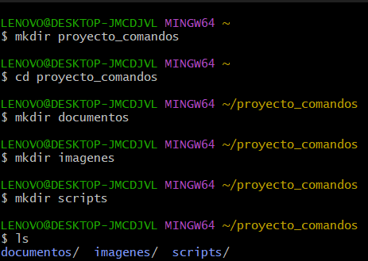
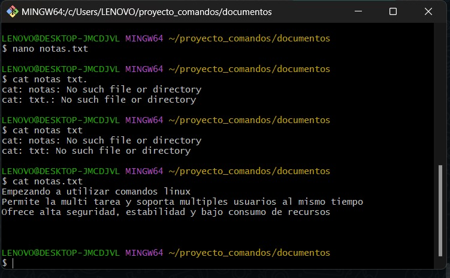
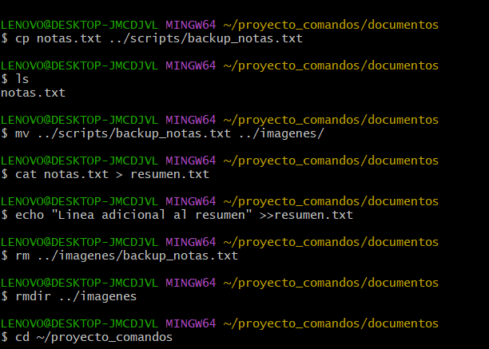

# Informe Práctica No. 1 – Manejo Básico de Archivos en Linux

## 1. Título  
*Práctica de Manipulación de Archivos y Directorios en Linux con Comandos Básicos*

## 2. Tiempo de duración  
Duración aproximada: 50 minutos

## 3. Fundamentos  
Linux es un sistema operativo basado en la línea de comandos que permite manipular archivos, directorios y permisos de manera eficiente. Los comandos fundamentales como mkdir, echo, cp, mv, rm permiten crear, mover, copiar y eliminar archivos. Esta práctica introduce a la creación y gestión de archivos mediante la terminal, lo cual es esencial para administradores de sistemas y desarrolladores.

## 4. Conocimientos previos  
- Uso básico de la terminal de Linux.  
- Comandos esenciales de Linux como mkdir, cp, mv, echo.  
- Conceptos de redirección y manipulación de archivos.

## 5. Objetivos a alcanzar  
- Crear y organizar directorios mediante comandos.  
- Manipular archivos con echo y redirección.  
- Eliminar y mover archivos de forma eficiente.

## 6. Equipo necesario  
- Computadora con sistema operativo Linux o terminal Bash.  
- Conexión a GitHub para subir el informe.  
- Editor de texto (como nano o vim).

## 7. Material de apoyo  
- Documentación oficial de comandos Linux: https://linux.die.net/  
- Guía de la asignatura.  
- Cheat sheet de comandos de Linux.

## 8. Procedimiento  

### Paso 1: Crear la carpeta principal y subcarpetas  

mkdir -p proyecto_comandos/documentos proyecto_comandos/imagenes proyecto_comandos/scripts

### Paso 2: Crear archivo notas.txt y agregar contenido

### Paso 3: Copiar y renombrar el archivo
### Paso 4: Mover el archivo a la carpeta imagenes
### Paso 5: Crear resumen.txt y redirigir contenido bash Copiar Editar
### Paso 6: Eliminar archivo y carpeta
### Paso 7: Guardar historial en archivo

## 9. 

Se creara correctamente la estructura de carpetas.

El archivo notas.txt contuviera el texto adecuado.

Los archivos se copiaran, movieran y eliminaran sin errores.

El historial de comandos estuviera guardado en tarea-s1-nombre_usuario.txt.

El repositorio en GitHub tuviera el informe y los archivos necesarios.

## 10. Bibliografía
Torvalds, L., & Diamond, D. (2016). Linux: El sistema operativo de código abierto. Ediciones O'Reilly.

González, M. (2020). Fundamentos de la línea de comandos en Linux. Ediciones Pearson.

The Linux Documentation Project. (2021). Guía de comandos de Linux. https://tldp.org